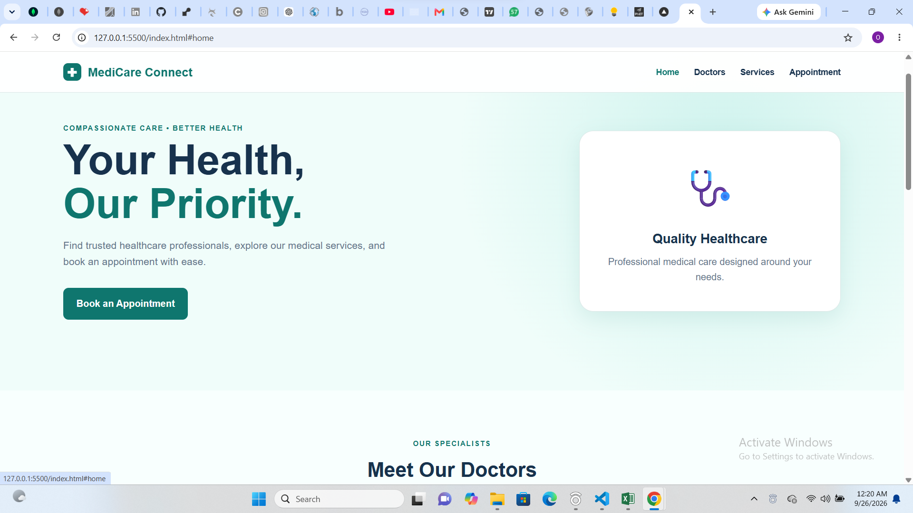
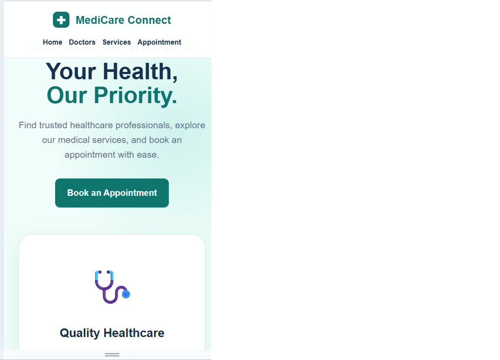

# 🏥 MediCare Connect — Hospital Appointment Website

A responsive and user-friendly hospital appointment website that allows patients to explore healthcare services, view available doctors, and schedule appointments through an interactive booking form.

This project was created as part of **Task 14 of the SpireX Foundation Frontend Internship**.

## 🚀 Live Demo

Add your deployed project link here.

## 📸 Preview




## ✨ Features

- 🏥 Clean and responsive healthcare interface
- 👨‍⚕️ View available doctors and their specialties
- 🩺 Explore available medical services
- 📅 Select an appointment date
- ⏰ Select a preferred appointment time
- 👤 Enter patient information
- 🔘 Select a doctor directly from the doctor cards
- ✅ Appointment form validation
- 🚫 Prevents selection of past appointment dates
- 📋 Displays appointment confirmation after successful submission
- 📱 Responsive design for desktop, tablet, and mobile devices

## 🛠️ Technologies Used

- HTML5
- CSS3
- JavaScript
- DOM Manipulation
- JavaScript Events
- Responsive Web Design

## 📂 Project Structure

```text
spirex-task-14-hospital-appointment/
│
├── index.html
├── style.css
├── script.js
├── README.md
├── preview.png
└── .gitignore
```

## ⚙️ How It Works

1. Patients can browse the available doctors.
2. Patients can explore the healthcare services.
3. A doctor can be selected directly from the doctor card.
4. The selected doctor is automatically added to the appointment form.
5. Patients provide their personal information.
6. Patients select a doctor, service, date, and preferred time.
7. JavaScript validates the appointment information.
8. Past appointment dates are rejected.
9. A confirmation message is displayed after a successful booking.

## 🧠 What I Learned

Through this project, I strengthened my understanding of:

- DOM manipulation
- JavaScript event listeners
- Form handling and validation
- HTML form elements
- Data attributes
- Dynamic content updates
- Date handling with JavaScript
- Conditional statements
- Template literals
- Responsive CSS layouts
- Creating user-friendly interfaces

## 📱 Responsive Design

The website adapts to different screen sizes, including:

- Desktop
- Tablet
- Mobile devices

## 🎯 SpireX Foundation Task

**Task:** Task 14 — Hospital Appointment Website

**Internship:** SpireX Foundation Frontend Internship

**Date:** September 2026

**Submission Deadline:** 22 September 2026, before 4:00 PM

## 👨‍💻 Author

**Oluwatobi Oluwagbohun**

Frontend / Full-Stack Developer

---

⭐ Built as part of my practical frontend development journey with SpireX Foundation.